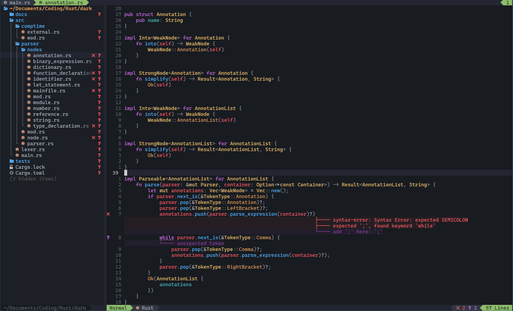

# int.lua

Neph Iapalucci's Neovim configuration, all in one file. 

## Showcases

## Why One File?

It's not uncommon that people ask why my entire configuration is in one file instead of being split into modules. Truthfully, I don't believe my configuration is complex enough that it really needs to be. My general rule of thumb (in any program) is that files should max out at about 1000 lines, and my configuration is nowhere near that. Keeping it in a single file makes it convenient to move around and send wherever I need to; My entire configuration is a copy-paste away.

## Use Cases

My configuration is primarily designed for Rust, because that is what I use most often; However, it will also ensure that semantic highlighting and LSPs are present in most popular languages. The following are all at least relatively set up:

- C
- C#
- C++
- Go
- Lua
- Python
- Rust
- Zig

## Prerequisites

Node and NPM are required to install several of the LSP servers that are set up to auto-install if they are not found.

Additionally, I use the [Kitty](https://github.com/kovidgoyal/kitty) terminal with an unpatched font; Rendering results may vary when using a different terminal with a patched font.

## Plugins

The following is the list of all plugins and what they do:

- [cmd-buffer](https://github.com/hrsh7th/cmp-buffer) - A plugin that integrates autocomplete into the currently active buffer.
- [cmp-cmdline](https://github.com/hrsh7th/cmp-cmdline) - A plugin that integrates autocomplete into the Vim command line.
- [icon-picker.nvim](https://github.com/ziontee113/icon-picker.nvim) - A plugin to simplify the process of typing special unicode glyphs and icons.
- [Lazy.nvim](https://github.com/folke/lazy.nvim) - A modern and efficient plugin manager.
- [lsp-colors.nvim](https://github.com/folke/lsp-colors.nvim) - A plugin to automatically create missing LSP diagnostic highlight groups for color schemes that don't yet support the Neovim 0.5 builtin LSP client.
- [lsp_lines.nvim](https://git.sr.ht/~whynothugo/lsp_lines.nvim) - A plugin to show LSP diagnostics on their own lines and point right to the character thatcaused the diagnostic.
- [lualine.nvim](https://github.com/nvim-lualine/lualine.nvim) - A pretty status bar replacement for the bottom of the screen. 
- [markdown-preview.nvim](https://github.com/iamcco/markdown-preview.nvim) - A plugin to view Markdown files live as you type, with many features including synchronized scrolling.
- [mason.nvim](https://github.com/williamboman/mason.nvim) - A modern and easy to use LSP installer.
- [lsp-zero.nvim](https://github.com/VonHeikemen/lsp-zero.nvim) - A plugin to enable `nvim-cmp` and `nvim-lspconfig` to work together.
- [neo-tree.nvim](https://github.com/nvim-neo-tree/neo-tree.nvim) - A file tree explorer. I've also tried out [nerdtree](https://github.com/preservim/nerdtree) and [nvim-tree](https://github.com/nvim-tree/nvim-tree.lua), and found `neo-tree` to be the best choice sylistically and functionally. 
- [noice.nvim](https://github.com/folke/noice.nvim) - A plugin for redesigning the entire Neovim UI, including the command line, searching, notifications, and more.
- [nvim-cmp](https://github.com/hrsh7th/nvim-cmp) - A plugin that provides autocomplete intellisense live while you type.
- [nvim-highlight-colors](https://github.com/brenoprata10/nvim-highlight-colors) - A plugin that highlights colors in the editor based on the color they represent, supporting hex, rgb, hsl, and more.
- [nvim-treesitter](https://github.com/nvim-treesitter/nvim-treesitter) - A plugin that parses source code to provide accurate semantic highlighting.
- [onedarker-pro.nvim](https://github.com/NephIapalucci/onedarker-pro.nvim) A custom made darker and more colored variant of the [onedark theme](https://github.com/navarasu/onedark.nvim).
- [run.nvim](https://github.com/NephIapalucci/run.nvim) - A plugin that allows running any project with the press of a button, no configuration required.
- [rust.vim](https://github.com/rust-lang/rust.vim) - A plugin to provide the most up-to-date support for the Rust language.
- [searchbox.nvim](https://github.com/VonHeikemen/searchbox.nvim") - A plugin that moves the search box to a prettier textbox in the upper corner
- [tabline.nvim](https://github.com/kdheepak/tabline.nvim) - Adds a pretty tabline at the top of the screen to show the open buffers
- [todo-comments.nvim](https://github.com/folke/todo-comments.nvim) - A plugin to highlight special comments in your code such as TODO and FIXME comments. 
